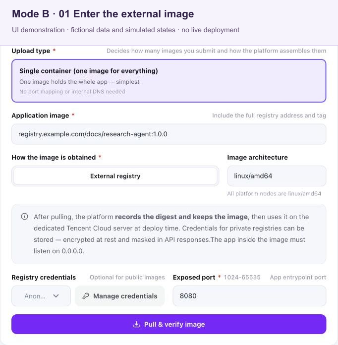
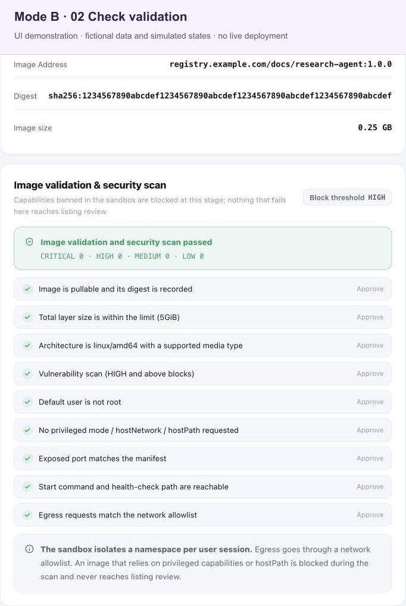
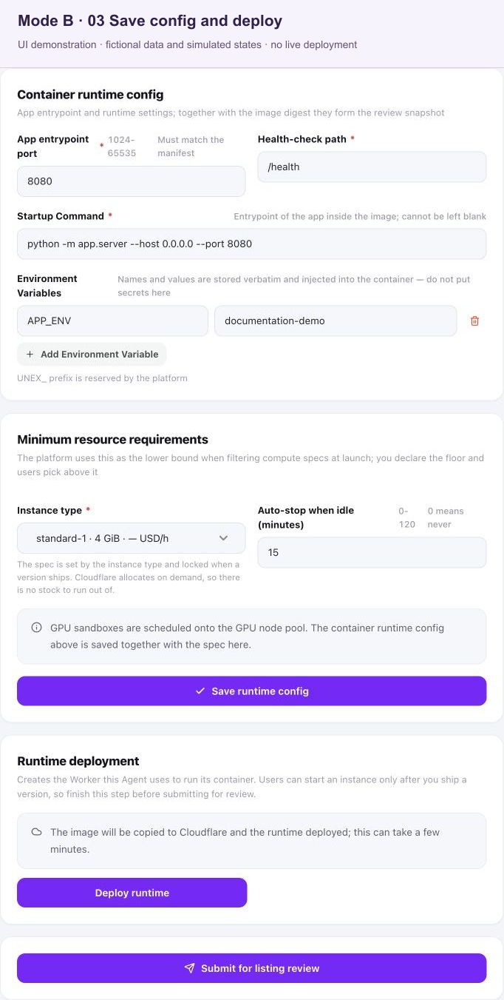

# Mode B Agent development and upload guide

<!-- DOCS-NAV:START -->
[Documentation home](README.md) · [Mode A technical preview](agent-development-mode-a.md) · [Chat Completions API](chat-completions.md) · [Agent Developer Center ↗](https://unexhub.ai/agent-doc) · [简体中文](../zh-CN/agent-development-upload.md)

**Browse:** [Start here](README.md#start-here) · [API & account](README.md#api-and-account) · [Apps & editors](README.md#apps-and-editors) · [CLI & coding agents](README.md#cli-and-coding-agents) · [Agent development](README.md#agent-development) · [API reference](README.md#api-reference)
<!-- DOCS-NAV:END -->

<!-- DOCS-TOC:START -->
<details open>
<summary><strong>On this page</strong></summary>

1. [1. Before you start](#section-1)
2. [2. Runtime requirements and instance types](#section-2)
3. [3. Model access and persistent storage: current limits](#section-3)
4. [4. Web routing and streaming responses](#section-4)
5. [5. Build and verify locally](#section-5)
6. [6. Push to your external image registry](#section-6)
7. [7. Configure, deploy, and submit for review](#section-7)
8. [8. Updates and planned upload options](#section-8)
9. [9. Troubleshooting](#section-9)
10. [10. Release checklist and reusable development brief](#section-10)
</details>
<!-- DOCS-TOC:END -->

[Repository home](../../README.md)

For Agent developers · Mode B / Cloudflare Containers

Document version: 1.1 · Updated: 2026-09-29

> **Scope:** This guide covers Mode B. For the separate dedicated-node workflow, see the [Mode A technical-preview guide](agent-development-mode-a.md). “Current” below describes the available workflow; “planned” describes work that is not implemented.

Mode B runs your single OCI container image on Cloudflare Containers. You build and publish the image; the platform copies it to its Cloudflare registry and deploys the Worker/Container runtime. User instances start for sessions and are reclaimed after idling. You do not deploy the platform's Worker yourself.

The current artifact workflow is **build a `linux/amd64` image → push to your external Registry → validate the source image and scan it → save runtime settings → deploy the runtime → test and submit for review**. Public and private external registries are supported; private images use Registry read-only credentials saved through the platform's credential controls.

> **Release limitation:** The image workflow exists, but safe model access for untrusted third-party images is not complete. Current runtime injection of a long-lived user–Agent model key should be used only for trusted internal compatibility tests; it is not a safe production contract. The trusted model proxy and per-user D1/R2 workspaces described in [section 3](#section-3) are planned. A successful deployment does not resolve these limitations.

Examples use `my-agent:1.0.0` and port `8080`. Replace Registry placeholders and model identifiers with values appropriate to your project. This guide does not supply an example project's image or credentials.

<a id="section-1"></a>
## 1. Before you start

| Requirement | What to check |
| --- | --- |
| Platform developer account | You can create an Agent and edit its deployment configuration. |
| Local Docker installation | Docker Desktop or Docker Engine is running, and `docker version` works. |
| Application | You have a Dockerfile, pinned dependencies, a web entry point, business APIs, and a lightweight health endpoint. |
| Your external image registry | You know the complete image reference and can push to the repository. For a private image, prepare separate read-only pull credentials for the platform. |
| Resource measurements | Measure memory, CPU, startup time, and temporary disk use before selecting an instance type. |
| Model and data requirements | Identify the models and durable data your Agent needs, and check the release limitations in section 3. |

Do not embed personal model keys, Registry passwords, or Cloudflare administration credentials in the image. These credentials serve different purposes. Keep Registry credentials in the platform's credential controls, outside the Agent's environment variables.

### Choose the available artifact path

| Method or artifact | Current status |
| --- | --- |
| One image in an external Registry | The available Mode B workflow. Enter a complete image reference; choose read-only credentials for a private repository. |
| Docker push to your own Registry | The local publishing step before the platform pulls your image. |
| Browser upload of an image TAR | Not implemented. There is no current Mode B browser TAR upload route. |
| Docker push directly to the platform | Not implemented. Do not assume the platform provides a push endpoint or write credentials. |
| Source ZIP or `docker export` archive | Not a supported image artifact for this workflow. |

The planned three-entry upload experience is described in [section 8](#section-8). It does not change the current external-Registry procedure.

<a id="section-2"></a>
## 2. Runtime requirements and instance types

| Item | Requirement or recommendation |
| --- | --- |
| Deployment mode | Select “Mode B · Cloudflare Containers.” |
| OS and architecture | Build `linux/amd64`, including on an Apple Silicon Mac. |
| Listener | Listen on `0.0.0.0` at the configured port. A listener bound only to `127.0.0.1` is unreachable from outside the container. |
| Entry port | Required; the platform accepts `1024–65535`. This guide uses `8080`. The application's actual listener and runtime configuration must match. |
| Web entry point | `GET /` serves the interface. Prefer same-origin web and business API requests. |
| Health path | Required, non-empty, and beginning with `/`; for example, `/health`. A fast HTTP 200 JSON response without a model call is recommended. |
| Startup command | Optional. Leave it empty to use the image's `ENTRYPOINT` / `CMD`, even if a current form displays a required marker. |
| Custom environment variables | Stored and returned as plaintext. Use only non-sensitive settings. Names must not begin with the reserved `UNEX_` prefix. |
| Process and shutdown | Run as a non-root user, keep the main process in the foreground, handle SIGTERM, and cancel unfinished upstream requests. Do not require privileged mode or the Docker socket. |
| Storage | Container memory and disk are temporary. Per-user platform persistence is not implemented. |
| Network and logs | Set connection and response timeouts; close streams on cancellation. Log request IDs, stages, durations, and safe errors, without keys, full session URLs, or sensitive inputs. |

**Readiness currently checks whether the exposed port is reachable, not the HTTP response from the health path.** A reachable port can be marked ready even if `/health` returns 404 or the business API is broken. Supply a valid health path and test its response separately.

`EXPOSE 8080` documents the intended port; it does not create a listener. Keep it consistent with your application and form. A default nginx image listening on port 80 needs its application configuration changed to a permitted port such as 8080. Local success with `docker run -p 80:80` does not satisfy the platform's port validation.

### Select one of the six platform instance types

| Instance type | vCPU | Memory | Disk | Typical fit |
| --- | --- | --- | --- | --- |
| `lite` | 1/16 | 256 MiB | 2 GB | Very small preprocessing services |
| `basic` | 1/4 | 1 GiB | 4 GB | Lightweight APIs and scripts |
| `standard-1` | 1/2 | 4 GiB | 8 GB | General single-container applications |
| `standard-2` | 1 | 6 GiB | 12 GB | Medium workloads |
| `standard-3` | 2 | 8 GiB | 16 GB | More demanding workloads |
| `standard-4` | 4 | 12 GiB | 20 GB | Heavy workloads |

These are the platform's current tier definitions, not a claim about every Cloudflare plan. Choose and save an instance type before review. **Mode B fixes it at the published version; users cannot change it at launch.** In Mode A, the user chooses a node SKU before launch.

`lite` has only 256 MiB of memory. Do not assume it will fit a JVM or a large application dependency tree; measure your image. The platform controls concurrent instances, with a current default cap of 50. A concurrency cap limits simultaneous exposure, not total cost. Cost also depends on instance type, running time, actual resource metering, and the platform's separate budget and settlement rules.

### Keep temporary state disposable

Browser `localStorage` may hold only small, non-sensitive, disposable UI state, such as display preferences. It is tied to a browser profile and origin, may be cleared, and does not provide reliable synchronization across devices or users. Never store keys, Authorization headers, `session` values, credentials, sensitive conversations, or records that must be recoverable there.

Do not promise durable files from container disk or browser storage. A separately arranged external data service needs its own reviewed access and retention design; it is not the planned platform workspace.

Use a multi-stage build when appropriate—for example, build Vue assets first, then copy the assets and production backend dependencies into one runtime image. Exclude local secrets and development artifacts from the Docker build context:

```text
.git
.idea
.env
.env.*
!.env.example
**/node_modules
**/__pycache__
**/.pytest_cache
**/.venv
**/*.log
**/*.pyc
```

Keep real `.env` files out of version control too. Scan the final image: deleting a secret in a later layer does not remove it from earlier layers.

<a id="section-3"></a>
## 3. Model access and persistent storage: current limits

### Current model-key injection and its compatibility limit

The current runtime injects `UNEX_API_KEY`, `UNEX_API_BASE_URL`, `UNEX_AGENT_ID`, and `UNEX_USER_ID`. The model key is created for a user–Agent pair, but it is a long-lived credential readable by the container process. A developer-controlled image, a dependency inside it, or an operator with environment access may obtain it. Keeping it out of the browser does not prevent those exposures.

Existing trusted internal test images may need this behavior for compatibility. **Do not make real `UNEX_API_KEY` injection a requirement for a new third-party Agent, and do not treat it as production isolation.** This guide therefore provides no real-key injection template. Do not work around missing credentials by hard-coding a key, requesting one in the browser, or using a shared developer key. Image instances do not normally provide an `unex_agent_token` URL fragment.

### Planned model contract — not implemented

The intended replacement is a platform-controlled outbound proxy. The container would receive only:

```text
UNEX_MODEL_BASE_URL=http://model.unex.invalid/v1
```

This virtual address is **not currently provided or usable**. Once implemented, the container backend would send standard model requests there without possessing a real user token. A trusted outbound handler would identify the container's trusted session; the model gateway would check the user, Agent, active session, model allowlist, and current budget before accounting for usage. Container-supplied user IDs, identity headers, and `session_id` values must not determine billing identity.

The following is a future-only integration sketch, not a working current-platform example. It deliberately fails when the expected contract is unavailable and has no key or hostname fallback:

```javascript
// Planned contract only: the platform proxy is not implemented yet.
const baseURL = process.env.UNEX_MODEL_BASE_URL;
if (baseURL !== "http://model.unex.invalid/v1") {
  throw new Error("This runtime has not enabled the platform model proxy");
}
const model = process.env.LLM_MODEL;
if (!model) throw new Error("Select a platform-allowed model");

const response = await fetch(`${baseURL}/chat/completions`, {
  method: "POST",
  headers: { "Content-Type": "application/json" },
  body: JSON.stringify({
    model,
    messages: [{ role: "user", content: "Hello" }],
  }),
  signal: AbortSignal.timeout(30_000),
});
if (!response.ok) throw new Error(`Model request failed: ${response.status}`);
```

Setting that environment variable yourself does not enable the proxy. If a future SDK integration requires an `apiKey` field, it may use only a fixed non-secret placeholder; the trusted proxy must discard container-supplied Authorization. There must be no fallback to a real key or a public model hostname.

When model access is supported for your release, keep the actual model ID, any application setting such as `LLM_MODEL`, the Agent allowlist, and available account routes consistent. Return the active model from the backend for display. Treat unsupported parameters and tool calls as explicit errors; do not silently switch models or repeatedly retry paid requests.

### Planned per-user storage — not implemented

There is currently no per-user D1/R2 workspace. Local container files can disappear when the instance stops; interface text referring to persistent R2/D1 does not make that capability available.

The target is a stable workspace for each `(agent_id, user_id)` pair, shared by that user's new sessions and image versions. D1 would hold small state, versions, file indexes, and quotas; private R2 would hold uploaded files and result bytes. A platform-controlled Storage Broker would expose only the current session's authorized data through the planned virtual address:

```text
UNEX_STORAGE_BASE_URL=http://storage.unex.invalid/v1
```

This address and the workspace are **not implemented**. Future storage integrations must remain disabled unless the platform explicitly enables the contract; they must not fall back to container disk while reporting “saved.” Containers would receive no D1 bindings, R2 account keys, bucket-wide access, or arbitrary object-key access.

The planned file flow begins on an authenticated session page: reserve workspace capacity → issue short-lived upload permission for one staging object → upload with progress → validate actual size, content, scan results, and quota → promote to private storage and return a `file_id`. The user should then be able to view, download, and explicitly delete their files through the platform, including after the container stops. Other users must be denied even if they know a file ID. This entire flow still needs implementation and validation.

Deployment-artifact staging and a user's persistent workspace are different storage and permission domains. A bucket used to stage an image TAR is not user file persistence. Model charges, runtime charges, and any future storage fees or free allowance also require separate disclosure. Until these changes ship, do not promise token isolation for untrusted images or cross-session file recovery.

<a id="section-4"></a>
## 4. Web routing and streaming responses

### Route every request to the same instance

The current platform routes user traffic using the `session` parameter in the entry URL. Browsers do not automatically copy page query parameters to JavaScript, CSS, image, or API requests. A successful HTML request does not prove that its assets can load.

A practical approach is:

1. Inline JavaScript, CSS, and small icons into production HTML; Vue/Vite projects can use a single-file build.
2. Use same-origin relative API URLs and explicitly forward the current `session`.
3. Preserve the entry URL's path prefix. Set `Referrer-Policy: no-referrer` and keep session values out of external requests and logs.

Example API URL construction:

```typescript
function apiUrl(path: "config" | "chat"): URL {
  const url = new URL(`api/${path}`, document.baseURI);
  const session = new URL(window.location.href)
    .searchParams.get("session");
  if (session && url.origin === window.location.origin) {
    url.searchParams.set("session", session);
  }
  return url;
}
```

Read `session` from the current entry URL only for same-origin requests. Do not copy it into `localStorage` or `sessionStorage`, or treat it as a container-supplied billing identity. If assets remain separate, test fonts, images, and dynamic imports as well. Vite's `base: "./"` alone does not preserve query parameters.

Test `/health` directly in the local container. Public Worker requests still follow platform session routing; users should open their instance through the platform rather than navigate to a bare hostname.

### HTTP 200 does not mean generation succeeded

A streaming response can send HTTP 200 before generation finishes. Agree on terminal events between your frontend and backend. For example, your application could use:

```text
event: token
data: {"content":"OK"}

event: done
data: {"model":"your-allowed-model-id"}
```

An error can arrive inside an HTTP 200 response:

```text
event: error
data: {"code":"upstream_unavailable","retryable":false}
```

These are illustrative application SSE events, not universal event names for every model API. Handle success, failure, cancellation, and unexpected stream termination explicitly; close the upstream request when the browser disconnects.

<a id="section-5"></a>
## 5. Build and verify locally

Run these Bash/zsh examples from your application project root.

### Build an amd64 image

```bash
docker buildx build \
  --platform linux/amd64 \
  --load \
  -t my-agent:1.0.0 .

docker image inspect my-agent:1.0.0 \
  --format '{{.Os}}/{{.Architecture}} user={{.Config.User}}'
```

Confirm `linux/amd64` and a non-root runtime user. `EXPOSE 8080` still requires the application to listen on `0.0.0.0:8080`.

### Check startup, the page, and resource use

```bash
docker run --rm -d \
  --name my-agent-local \
  --platform linux/amd64 \
  -p 127.0.0.1:8080:8080 \
  my-agent:1.0.0

curl --fail http://127.0.0.1:8080/health
curl --fail -o /dev/null http://127.0.0.1:8080/
docker logs --tail 80 my-agent-local
docker stats --no-stream my-agent-local
```

Open `http://127.0.0.1:8080/` in a browser. The page and health check should work without model access; the chat action should clearly state when a supported model integration is unavailable. Check startup and peak workload memory as well as idle memory before choosing a tier.

### Test streaming without real credentials

Provide a local mock model service or equivalent test harness through your application's own test configuration. Use it to exercise request paths, model IDs, tokens, completion, upstream errors, timeouts, and cancellation. It must use fake data and no real user or developer key. A local mock does not establish that the planned platform proxy is available or that production billing isolation works.

On Docker Desktop, a container can reach a host test service through `host.docker.internal`; on Linux Docker Engine, configure an appropriate host route. The container's `127.0.0.1` refers to the container itself. Keep mock endpoints and test-only overrides out of the release configuration.

Cancel a generation and confirm the upstream call stops. Then verify bounded shutdown:

```bash
docker stop --time 15 my-agent-local
```

Test the page, health response, application flow, session routing, and shutdown separately. Port readiness alone proves none of the other results.

<a id="section-6"></a>
## 6. Push to your external image registry

### Publish an image you control

Use the Registry host, repository path, and login instructions from your chosen Registry. Public images allow anonymous platform pulls. For private images, configure read-only pull credentials through the platform; your local push credentials can have different permissions.

Replace all placeholders below. Use a new version tag for each release:

```bash
AGENT_REGISTRY='YOUR_REGISTRY_HOST'
AGENT_REPOSITORY='YOUR_NAMESPACE/YOUR_REPOSITORY'
AGENT_VERSION='1.0.0'
AGENT_IMAGE="$AGENT_REGISTRY/$AGENT_REPOSITORY:$AGENT_VERSION"

docker login "$AGENT_REGISTRY" --username 'YOUR_LOGIN_NAME'
docker tag my-agent:1.0.0 "$AGENT_IMAGE"
docker push "$AGENT_IMAGE"
```

Enter the password at Docker's interactive prompt. Do not put it in a script, Dockerfile, source tree, chat, or Agent environment variable. Pushing here publishes to your own Registry; it is not a direct push to the platform.

### Record and verify the source digest

Record the `sha256:...` digest printed after the push. A tag is a convenient name; the digest identifies the content. Inspect the remote image when needed:

```bash
docker manifest inspect "$AGENT_IMAGE"
```

For a public image, also verify access from an environment without saved Registry credentials. A successful authenticated pull does not prove anonymous access. For a private image, select its saved read-only credentials on the platform.

Platform source validation fixes the source digest and records size and architecture while triggering scanning. Moving the tag afterward does not change the already-bound digest; submit the image reference for validation again when making a new candidate version.

<a id="section-7"></a>
## 7. Configure, deploy, and submit for review

Open [Agent deployment configuration](https://unexhub.ai/console/my_agents?tab=deploy) in the developer console. Mode B currently uses one image from an external Registry. Shared form labels referring to local archives, other compute providers, GPU support, or persistent R2/D1 are not evidence that those capabilities exist for Mode B.

### Fill the runtime form

| Form field | Example and rule |
| --- | --- |
| Deployment mode | Mode B · Cloudflare Containers |
| Image source | External image registry |
| Image reference | Complete `Registry/namespace/repository:version`, without `https://` |
| Registry credentials | Anonymous for a public image; selected read-only credentials for a private image |
| Entry port | `8080`; must match the listener and be in `1024–65535` |
| Health path | `/health`; required and begins with `/` |
| Startup command | Empty to use the image's `ENTRYPOINT` / `CMD` |
| Instance type | Required; select one of the six tiers based on measurements, for example `basic` |
| Idle reclamation | Choose a supported duration appropriate for the workload; temporary files can be lost when the instance stops |
| Custom environment variables | Non-sensitive application settings only, such as an allowed model ID in `LLM_MODEL`; stored as plaintext, with no `UNEX_` names |
| Model allowlist | Include only the actual models required by the Agent; this setting does not enable the planned proxy |

### Follow the deployment stages

> **About these screenshots:** These are UI demonstrations of the current, unchanged application component rendered locally with fictional data and mocked backend states. This English guide shows the English UI; the Chinese companion shows the Chinese UI. Registry references and digests in the images are placeholders. The screenshots are not evidence of a production upload, validation, image copy, or deployment.

#### Step 1: Enter the external image reference

Create or select the Agent, choose **Mode B** and **External registry**, and enter the complete reference for one image. For a private image, save and select its read-only credentials. Set the matching entry port within `1024–65535`.



*Figure B1. Mode B currently accepts one image reference from an external Registry; the reference shown is an example.*

The helper paragraph still mentions a dedicated Tencent Cloud server because this is shared UI copy. Mode B deploys to Cloudflare Containers; that paragraph does not add a Tencent Cloud deployment option.

**Checkpoint:** The reference points to the image you pushed, contains no `https://` prefix, and uses the appropriate public or private pull access. Mode B has no current browser TAR upload or direct platform Docker Push entry.

#### Step 2: Verify the image and scan result

Select **Pull & verify image**. Check the source digest, size, and `linux/amd64` architecture. Validation also triggers image scanning; production releases require scanning to be enabled and passed.



*Figure B2. Source-image validation and security scanning are separate from runtime deployment; the displayed states are demonstrations.*

The green checklist and its per-session namespace/network-allowlist wording do not prove a specific isolation mechanism or resolve the credential limitations in section 3. Verify actual scan results and runtime behavior separately.

**Checkpoint:** Record the resolved source digest and inspect the scan result. **Source validated ≠ Cloudflare image copy ready ≠ Worker runtime available.** Inspect the error for the failed stage, and do not treat a pending or disabled scan as a passed production check.

#### Step 3: Save settings and deploy the runtime

Set the entry port, health path, instance type, idle timeout, and any non-sensitive settings, then select **Save runtime config**. The instance type is fixed for the published version. Next, select **Deploy runtime**. The platform first copies the validated image asynchronously into its Cloudflare registry; the page shows copy progress or failure and triggers the subsequent Worker/Container deployment after copying finishes.



*Figure B3. The page before runtime deployment: the save, deployment, and review actions are visible, but no deployed runtime is shown.*

The shared form marks **Startup Command** as required and says it cannot be blank. For Mode B, omitting the command uses the image's `ENTRYPOINT` / `CMD`; the command shown is an optional example override. The **Minimum resource requirements** heading, user-selection hint, and GPU-pool message are also shared UI copy. Mode B uses the published version's fixed instance type, with no GPU tier or launch-time node-SKU selection.

**Checkpoint:** Confirm both the Cloudflare copy and Worker runtime states. If the page says that no image is bound, return to image verification before trying to deploy. Keep the deployment page open until it is ready. If you leave, return and inspect the state; trigger deployment again if the page requires it. Do not assume all later stages continue automatically after closing the page.

#### Test and submit for review

Where developer testing is available, open a fresh test instance through the platform and verify the page, routing, application responses, and shutdown. Trusted internal compatibility testing does not resolve the third-party credential limitation in section 3.

Only after scanning passes and the runtime is ready, select **Submit for listing review** for the candidate. Ordinary users can launch only after review approval. Third-party model Agents must also satisfy the release prerequisites in section 10; a deployed runtime alone is insufficient.

Do not replace a version in place while it is under review or published. Use a new candidate and the platform's supported review process.

### User startup and charging

A user launches their instance through the platform, which checks access, balance, and pre-deduction rules before startup. Runtime-duration billing begins after the instance reaches `running`, not when the developer uploads or copies an image. Image processing before review may incur platform costs, but successful upload alone does not charge an end user for runtime.

Users open and stop their instance through the platform. Container runtime fees and model usage fees are separate; rates, budgets, settlement, maximum duration, and refund rules follow the platform's displayed terms. Future persistent-storage fees or allowances must be disclosed separately.

<a id="section-8"></a>
## 8. Updates and planned upload options

### Update or roll back by version and digest

Build, test, and push a new version such as `1.0.1`. Submit its reference, validate the new digest, scan, save the version's runtime settings, deploy, and follow review requirements. Open a new instance to verify the released version. A Registry tag push does not automatically change a bound image or a running container.

Use the platform's supported version-switching process for rollback, selecting the previous verified digest and its matching runtime settings. Retagging locally does not roll back an online instance. Keep release records of the source digest, chosen instance type, settings, and validation results.

### Planned three-entry upload experience

The unified experience below is a target. The external Registry entry exists today; browser TAR upload and direct platform Docker Push do not.

| Entry | Intended developer experience | Status and boundary |
| --- | --- | --- |
| Browser image upload | Upload a `docker save` or OCI Image Layout TAR, see progress, and resume interrupted uploads. | Planned. Uses short-lived permissions for private image staging, followed by archive validation and scanning. It is not a user-file workspace. |
| Docker Push to the platform | Receive short-lived credentials restricted to this Agent's repository, push, and detect a new candidate image. | Planned. No current Mode B platform push endpoint or credentials are supplied by this guide. |
| External Registry | Enter a full reference, optionally select private read-only credentials, and validate the image. | Current entry, retained in the planned unified flow. Credentials must remain outside user containers. |

A local archive can be prepared for backup or a future supported importer:

```bash
docker save -o my-agent-1.0.0-amd64.tar my-agent:1.0.0
```

There is currently no Mode B browser control to accept that TAR. `docker save` includes image configuration and layers; `docker export` contains a container filesystem and is not interchangeable. A TAR file hash is also different from a Registry image digest.

The target pipeline is **receive → validate → scan → copy image → deploy runtime → eligible for review**. It needs traceable source and platform-copy digests, scan results, instance type, and version identity. Completed uploads should eventually progress through durable background jobs even after the page closes, with stage-specific status and retries. That is planned behavior, not a description of the current page-triggered deployment sequence.

Future upload entry points must validate ownership, size, content, quota, and archives before deployment, reject unsafe or blocked artifacts, and publish immutable image references. Short-lived staging URLs are bearer capabilities, not a substitute for platform authorization. No planned upload option establishes model isolation or persistent user storage by itself.

<a id="section-9"></a>
## 9. Troubleshooting

| Symptom | Check and next step |
| --- | --- |
| Runs locally but fails on the platform | Confirm `linux/amd64`, a listener on `0.0.0.0`, and a configured port in `1024–65535`. Inspect startup logs and the image's default command. |
| Application listens on a different port | Correct the application listener or runtime entry port; `EXPOSE` alone does not change either. |
| Runtime ready but `/health` returns 404 | Current readiness checks port reachability. Fix and separately test the health route and business API. |
| No platform image copy is available | The copy is pending or failed. Inspect copy status before expecting Worker deployment to succeed. |
| Deployment did not finish after leaving the page | Return, inspect copy/runtime state, and trigger deployment again if required. |
| Instance type is missing | Select and save one of the six required tiers before review. |
| Environment variable fails with a reserved-prefix error | Rename custom variables so they do not begin with `UNEX_`; do not move secrets into another plaintext variable. |
| No browser TAR upload or platform Docker Push option | These entries are planned. Use the current external Registry workflow. |
| A legacy test image cannot read `UNEX_API_KEY` | This concerns the trusted-test compatibility path. Do not hard-code a long-lived key or ask the browser user for one. |
| No `unex_agent_token` fragment in the page URL | Image instances do not normally provide one. Do not require pasted tokens. |
| Planned model/storage virtual address is unavailable | Those proxies and per-user workspaces are not implemented. Setting their variables does not enable them. |
| Model request returns an authentication or permission error | For a supported trusted test, inspect sanitized errors and the platform's session, model, and budget settings. Do not bypass checks with shared keys or claimed user IDs. |
| Rate limit, timeout, or insufficient balance | Bound retries, stop paid retries for balance failures, and cancel upstream work when the user stops. |
| Blank page, failed assets, or `missing_session` | Reopen through the platform; verify that assets and same-origin API requests preserve session routing and the entry path prefix. |
| HTTP 200 but the interface reports failure | Inspect SSE error and terminal events, not only the HTTP status. |
| Files disappeared after restart | Container disk is temporary; per-user D1/R2 persistence is not yet available. |
| Old page or model after an update | Check the bound digest, instance version, and application settings, then open a new instance for the released version. |

For a support report, include the Agent ID, application version, image digest, stage, timestamp and timezone, request ID, HTTP status, sanitized error, and reproduction steps. Do not publish keys, Authorization headers, complete session URLs, Registry credentials, or another user's data.

<a id="section-10"></a>
## 10. Release checklist and reusable development brief

### Artifact and runtime checks

- [ ] One `linux/amd64` image runs as non-root and listens on `0.0.0.0` at the configured port in `1024–65535`.
- [ ] The root page and health route work; the health path begins with `/`, and application behavior is tested separately from port readiness.
- [ ] The chosen instance type fits measured resource use and is saved for the candidate version.
- [ ] Image layers, browser responses, and logs contain no keys; custom environment variables are non-sensitive and do not use `UNEX_` names.
- [ ] Page, asset, and API requests preserve session routing; session values do not reach external requests or browser storage.
- [ ] Streaming success, errors, cancellation, timeouts, and bounded SIGTERM shutdown have been verified.
- [ ] Container disk is treated as temporary; any `localStorage` contains only disposable, non-sensitive UI state.
- [ ] The platform can pull the source image, the validated digest is recorded, scanning is enabled and passed, the Cloudflare copy is ready, and the runtime is available.
- [ ] Review approval is obtained before ordinary-user launch; upload success is not reported as runtime billing or model/data isolation acceptance.

### Additional prerequisites for third-party production release

The following platform work is still required; do not mark it complete because an internal test or Worker deployment succeeded:

- [ ] Stop injecting long-lived `UNEX_API_KEY` credentials into third-party containers, rotate affected old keys, and deliver the trusted model proxy. Validate two-user attribution, model permissions, budgets, and revocation after the session stops, including any legacy token-exchange path.
- [ ] Before promising persistent data, deliver the per-user D1/R2 workspace, trusted Storage Broker, and user file controls. Verify cross-user denial, recovery after restart, quota handling, and explicit deletion.
- [ ] Before offering the planned upload options, test archive rejection, resumable upload, narrowly scoped expiring push permissions, immutable digests, and stage-specific recovery.

These checks establish specific release evidence; they do not justify a universal claim that every image or dependency is safe.

### Brief for an AI assistant or developer

```text
Build an Agent for Mode B / Cloudflare Containers.

Name: [fill in]
Users and purpose: [fill in]
Core workflow: [3–6 steps]
Inputs and outputs: [fill in]
Required models and durable data: [fill in; flag unavailable capabilities]
Stack: [existing stack, or Python FastAPI + Vue]

Delivery requirements:
1. One non-root linux/amd64 image, listening on 0.0.0.0:8080.
2. GET / serves the UI; GET /health promptly returns 200 JSON without
   a model call. Platform port readiness does not replace these tests.
3. Do not require real UNEX_API_KEY injection, personal keys, or shared
   keys. Keep unavailable model/storage integrations disabled. Planned
   virtual proxies may be used only after platform support is enabled;
   fail clearly without real-key, hostname, or fake-persistence fallbacks.
4. Preserve session routing and entry path prefixes on same-origin
   requests. Do not put session values in logs or browser storage.
5. Support streaming results, explicit completion/errors, cancellation,
   request timeouts, and bounded SIGTERM shutdown.
6. Treat container disk as temporary. localStorage may hold only
   non-sensitive, disposable UI state. Do not promise platform D1/R2
   persistence while its workspace and broker remain unimplemented.
7. Provide Dockerfile, .dockerignore, README, and mock tests that need
   no real credentials. Distinguish mock results from live verification.
8. Provide build, local run, and external Registry tag/push instructions,
   measured resource needs, and the selected platform instance type.
9. Provide runtime form values and deployment-stage verification.
   Custom environment variables are plaintext and must be non-sensitive.

Use the current external Registry workflow. Browser TAR upload and
direct platform Docker Push are planned. A deployable image alone
does not complete the third-party production release prerequisites.
```

### References and scope

This guide reflects the platform's Mode B baseline as of 2026-09-29. Instance tiers and user charging rules follow the platform's definitions and published pricing. Cloudflare limits and pricing can change; the links below explain the underlying services, not additional platform features:

- [Cloudflare Containers architecture and lifecycle](https://developers.cloudflare.com/containers/concepts/architecture/)
- [Cloudflare Containers image management](https://developers.cloudflare.com/containers/guides/image-management/)
- [Cloudflare Containers limits](https://developers.cloudflare.com/containers/platform/limits/)
- [R2 presigned URLs](https://developers.cloudflare.com/r2/api/s3/presigned-urls/)
- [D1 Worker API](https://developers.cloudflare.com/d1/worker-api/)

Agent developers use the platform's deployment page. Planned D1/R2 bindings belong to platform-controlled services and are not credentials developers should request for their containers.

<!-- DOCS-PAGER:START -->

---

[← Previous: Mode A Agent development](agent-development-mode-a.md) · [Documentation home](README.md)
<!-- DOCS-PAGER:END -->
