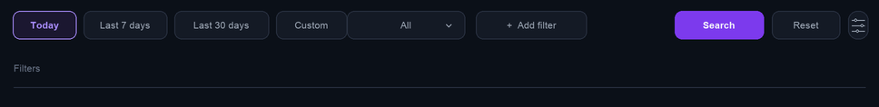
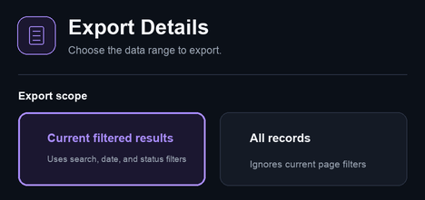

# Billing records and exports

<!-- DOCS-NAV:START -->
[Documentation home](README.md) · [Public API reference ↗](https://documenter.getpostman.com/view/57297668/2sBYArUsxK) · [Agent Developer Center ↗](https://unexhub.ai/agent-doc) · [简体中文](../zh-CN/billing.md)

**Browse:** [Start here](README.md#start-here) · [API & account](README.md#api-and-account) · [Apps & editors](README.md#apps-and-editors) · [CLI & coding agents](README.md#cli-and-coding-agents) · [Agent development](README.md#agent-development) · [API reference](README.md#api-reference)
<!-- DOCS-NAV:END -->

<!-- DOCS-TOC:START -->

<strong>On this page</strong>

1. [1) Find the request in the logs](#section-1)
2. [2) Review billing details and the final charge](#section-2)
3. [3) Review API consumption in the funds account](#section-3)
4. [4) Export an Excel statement](#section-4)
5. [5) Review usage trends](#section-5)
6. [6) Investigate unexpected charges or missing records](#section-6)

<!-- DOCS-TOC:END -->

Website: [UNEXHub](https://unexhub.ai/) · Interface reviewed: 2026-09-22

API charges made with a UNEXHub key are reviewed in UNEXHub, whether the request comes from code, third-party routing, Cherry Studio, or Chatbox.

## 1) Find the request in the logs

Open [Request Logs](https://unexhub.ai/console/log) and select today, the last 7 days, the last 30 days, or a custom range that includes the request time.

Filter by consumption for successful requests, or use all records or errors when investigating failures. Select Add Filter, use the token name, model name, or Request ID, then select Search.

| Field | What to verify |
| --- | --- |
| Time | Matches the request time and timezone. |
| Token and model | Match the key and model ID used. |
| Type | Distinguishes consumption, errors, and other records. |
| Input and output | Show usage; check cache reads and writes when present. |
| Cost | Shows a summary; open the details to confirm Final Charge. |

Available columns depend on account permissions. Check Column Settings if needed. The response `id` is not necessarily the console's Request ID. Without a request identifier, locate the request using its time, key, and model together.

## 2) Review billing details and the final charge

Open Details for the matching record → Request Detail Analysis → Billing Details. Confirm the model, status, request path, processing time, and Final Charge.

The page may show an official list price, channel discount, and calculation details. The official price is a reference; Final Charge is the amount actually deducted. Model pricing, route, caching, pricing tiers, and rounding may affect it.

### Distinguish model usage from accounting units

| Measure | Meaning |
| --- | --- |
| Input and output tokens | Model usage, indicating the size of the request. |
| Equivalent quota tokens | Monetary accounting units, not model input or output counts. |
| Final Charge | The amount actually deducted for the request. |

The reviewed billing detail states that equivalent quota tokens are converted at \$2 / 1M, with the resulting quota rounded to an integer. This defines an accounting conversion, not a universal \$2 / 1M price for every model.

Model pricing shown as \$/M means US dollars per million tokens. Input, output, cache creation, and cache reads may have different rates. Do not multiply all tokens by a single rate.

Supplier income and platform commission, if shown, describe how funds are allocated. Do not add those allocations to your final charge again when reconciling spending.

## 3) Review API consumption in the funds account

Open [Funds Account](https://unexhub.ai/console/topup) to view your balance components. Filter the records by date and API consumption, then check the amount, time, and status.

Funds records may show a daily consumption total and call count. Use request logs for individual charges. When comparing totals, use the same account, date range, and consumption type.

A top-up marked pending payment has not completed payment. Confirm that it has been credited before relying on that balance.

## 4) Export an Excel statement

Set the required date and API consumption filters, then select Export Details.

Choose an export scope:

| Option | Meaning |
| --- | --- |
| Current filtered results | Applies the current search, date, and status filters. |
| All records | Ignores the current page filters. |

Check the number of records to export and select Export Excel to download an XLSX file. Open it and verify the date range, record count, and amounts.

## 5) Review usage trends

Open [Usage Analytics](https://unexhub.ai/console/detail), choose a date range, and review call volume, token cost, average latency, and error rate. If a site-wide/personal switch is shown, choose your personal view to check your own usage.

Use trends for overall behavior and request details for individual charges. Time boundaries, aggregation rules, and display precision may cause differences between summaries and individual records.

## 6) Investigate unexpected charges or missing records

For missing records, verify the request environment and signed-in account, expand the date range, clear unnecessary filters, and refresh. Before retrying a timeout, check whether the original request completed.

Send [support@unexhub.com](mailto:support@unexhub.com) the Request ID if available, time and timezone, model, key name, error message, and charge amount. Do not send your complete key.

<!-- DOCS-PAGER:START -->

---

[← Previous: Third-party routing](third-party-routing.md) · [Documentation home](README.md) · [Next: FAQ and troubleshooting →](faq.md)
<!-- DOCS-PAGER:END -->
