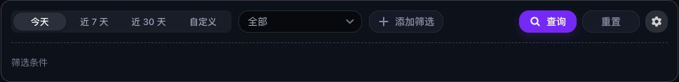

# Chatbox integration tutorial

<!-- DOCS-NAV:START -->
[Documentation home](README.md) · [Public API reference ↗](https://documenter.getpostman.com/view/57297668/2sBYArUsxK) · [Agent Developer Center ↗](https://unexhub.ai/agent-doc) · [简体中文](../zh-CN/chatbox.md)

**Browse:** [Start here](README.md#start-here) · [API & account](README.md#api-and-account) · [Apps & editors](README.md#apps-and-editors) · [CLI & coding agents](README.md#cli-and-coding-agents) · [Agent development](README.md#agent-development) · [API reference](README.md#api-reference)
<!-- DOCS-NAV:END -->

<!-- DOCS-TOC:START -->

<strong>On this page</strong>

1. [1) Open Chatbox](#section-1)
2. [2) Open Settings and select a model provider](#section-2)
3. [3) Enter API Host and API Key](#section-3)
4. [4) Add a model, test it, and save](#section-4)
5. [5) Close Settings and select the model](#section-5)
6. [6) Send a message and confirm the reply](#section-6)
7. [7) Review billing in UNEXHub](#section-7)

<!-- DOCS-TOC:END -->

Website: [UNEXHub](https://unexhub.ai/) · Interface reviewed: 2026-09-22

Prepare a UNEXHub key and a currently available model ID using [Quickstart](quickstart.md). Choose a [third-party routing key](third-party-routing.md) if you want third-party upstream channels.

This tutorial uses the built-in OpenAI configuration in Chatbox Web and the OpenAI-compatible Chat Completions interface.

## 1) Open Chatbox

Open [Chatbox Web](https://web.chatboxai.app/) or your installed desktop client.

## 2) Open Settings and select a model provider

Select Settings in the lower-left corner. Open Model Provider and choose OpenAI.

To preserve an existing OpenAI configuration, use Add → Add Custom Provider, enter `UNEXHub`, and select `OpenAI API Compatible` as the API Mode. Custom-provider fields can vary by version, so verify the final request URL.

## 3) Enter API Host and API Key

| Setting | Value |
| --- | --- |
| API Key | Your complete UNEXHub key, without `Bearer`. |
| API Host | `https://api.unexhub.ai`, without `/v1`. |
| Preview | Should show `https://api.unexhub.ai/v1/chat/completions`. |

Check that Preview does not contain `/v1/v1` or omit `/chat/completions`.

## 4) Add a model, test it, and save

Select New in the model area and enter the exact ID from the UNEXHub model details into Model ID. Use Test Model to verify the configuration, then select Save. Testing may incur API charges.

You can also try Fetch to retrieve models. Confirm that the selected model is available to your account and route.

## 5) Close Settings and select the model

Close Settings or press Esc. Create a conversation and use Select Model to choose the provider and model you configured.

## 6) Send a message and confirm the reply

Send “Reply with one short greeting.” After receiving a reply, note the time, key name, and model ID. If the request fails, check the key, API Host, Preview, and model status.

## 7) Review billing in UNEXHub

Open [Request Logs](https://unexhub.ai/console/log), locate the request by key name, model, and time, and review Final Charge in its details.

Tests, retries, or other client features may create additional requests. A client estimate may differ from the final charge. Review UNEXHub API charges separately from any Chatbox subscription. See [Billing records and exports](billing.md) to export your records.

<!-- DOCS-PAGER:START -->

---

[← Previous: FAQ and troubleshooting](faq.md) · [Documentation home](README.md) · [Next: Cherry Studio →](cherry-studio.md)
<!-- DOCS-PAGER:END -->
