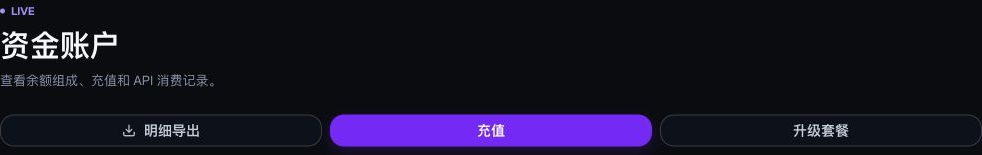
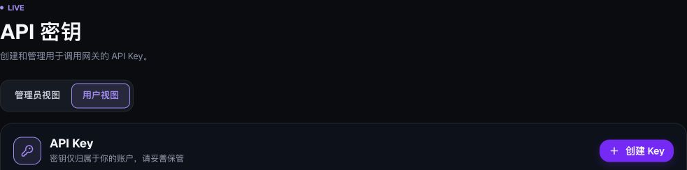
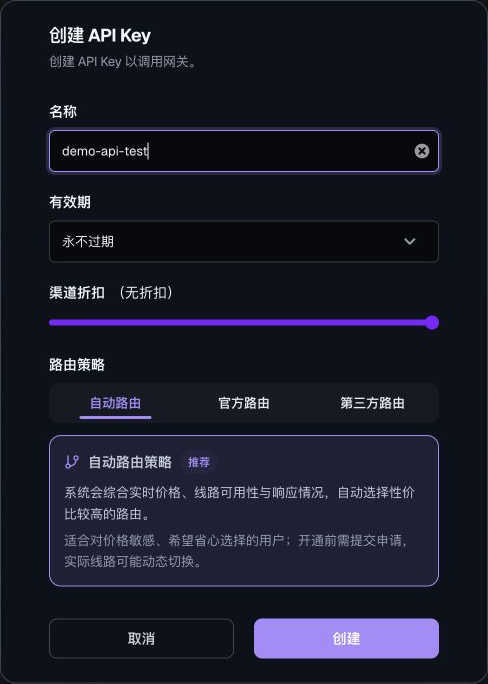
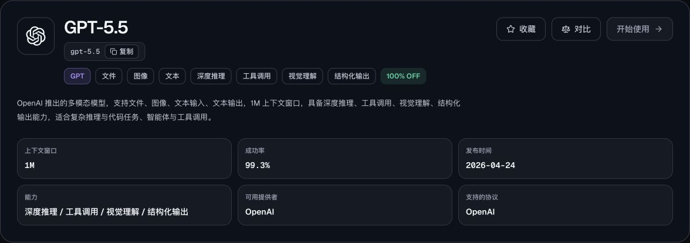
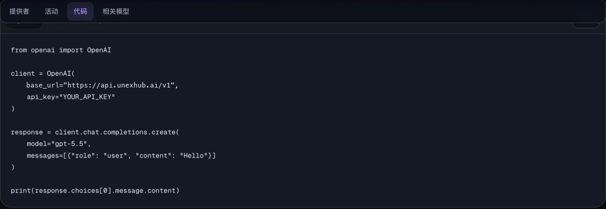

# Site guide — Get started with model APIs

[Documentation](README.md) · English | [简体中文](../zh-CN/quickstart.md)

Website: [UNEXHub](https://unexhub.ai/) · Interface reviewed: 2026-09-22

API Base URL: [https://api.unexhub.ai/](https://api.unexhub.ai/)

Create an account and sign in, then follow the steps below to call a model.

**API workflow:** Register → Add funds → Create an API key → Select a routing policy → Set expiration and budget → Choose a model → Send a request → Review billing.

**API connection = URL + API key.** Each request also needs the exact model ID, available on the model's marketplace page.

| Setting | Value |
| --- | --- |
| API root | `https://api.unexhub.ai` |
| SDK Base URL | `https://api.unexhub.ai/v1` |
| API key | Your complete key; shown as `YOUR_API_KEY` in examples. |
| Model ID | An exact, currently available model ID; shown as `YOUR_MODEL_ID`. |

Screenshots show the Chinese console. The instructions below describe the corresponding controls in English.

## 1) Add funds

In the console, open Personal Center → [Funds Account](https://unexhub.ai/console/topup) and check your available balance.

If needed, select Top Up, choose an amount, and complete the payment steps shown. Return to the funds account and confirm that the payment has been credited before making requests.



## 2) Create an API key

### a. Open API Keys and select Create Key

Open [API Keys](https://unexhub.ai/console/token) in the console. If a view switch is shown, select User View, then Create Key.



### b. Set the name, expiration, and routing policy

Use a name such as `demo-api-test`. Choose the expiration, channel discount, and routing policy, then select Create.



| Setting | Description |
| --- | --- |
| Name | Use a project or client name so you can identify its spending later. |
| Expiration | Choose never, 30 days, 90 days, or one year as appropriate. |
| Channel discount | Set the condition with the slider; check current channel availability and prices. |
| Routing policy | Automatic, official, or third-party routing. |

Automatic routing considers price, availability, and responsiveness. Complete the activation request if prompted. Official and third-party routes may have different prices and availability. See the [third-party routing tutorial](third-party-routing.md) for that workflow.

### c. Check key status and set a budget

Return to the list and confirm that the new key is enabled. Select Copy Key. Use Budget Limit on its card to set a daily, monthly, or total spending limit if needed.

Store the key in an environment variable or a secret manager. Do not commit a real key to GitHub or embed it in a public browser application. Use a separate key for each application to make spending easier to track.

### d. Choose a model in the marketplace

Open [Marketplace → Models](https://unexhub.ai/market?tab=models), search for a model, check its availability and pricing, and open its details.

### e. Copy the exact model ID and check the protocol and code

Copy the model ID, including its capitalization, hyphens, and version suffix. Confirm that the model supports the Chat Completions interface used here.



> The screenshot uses `gpt-5.5` to show where model details appear. Its Start Using button was unavailable when reviewed. Select a model currently available to your account and route; do not copy the screenshot's model name or prices as current recommendations.

## 3) Get the gateway connection details

Open your model's Code tab to view the connection settings and request format. The model code example uses:

```text
Base URL: https://api.unexhub.ai/v1
API Key:  YOUR_API_KEY
```



> The screenshot identifies the `base_url` and `api_key` fields. Replace both the key and model ID before running an example.

The website and console use `https://unexhub.ai/`; API calls use `https://api.unexhub.ai/v1`. Do not enter the website URL as the `base_url`.

## 4. Usage

Send the API key in an HTTP header:

```http
Authorization: Bearer YOUR_API_KEY
Content-Type: application/json
```

The example below is for text models that support Chat Completions. Replace `YOUR_API_KEY` and `YOUR_MODEL_ID`, then run it in macOS, Linux, or a Bash-compatible terminal. Successful calls are billed according to actual usage.

```bash
export UNEXHUB_API_KEY='YOUR_API_KEY'
export UNEXHUB_BASE_URL='https://api.unexhub.ai/v1'

curl -sS -i "$UNEXHUB_BASE_URL/chat/completions" \
  -H "Authorization: Bearer $UNEXHUB_API_KEY" \
  -H "Content-Type: application/json" \
  -d '{
    "model": "YOUR_MODEL_ID",
    "messages": [
      {"role": "user", "content": "Reply with one short greeting."}
    ],
    "stream": false
  }'
```

Read the model's reply from `choices[0].message.content` in the JSON response. When included, `usage` reports input, output, and total token counts.

See [Create a chat completion](chat-completions.md) for Python and parameter details. For a client application, follow the [Cherry Studio tutorial](cherry-studio.md) or [Chatbox tutorial](chatbox.md).

## 5) Replace the API address

For existing OpenAI-compatible code, replace the API address with the appropriate UNEXHub address and update the key and model ID.

| Integration | Address to enter |
| --- | --- |
| Python SDK `base_url` | `https://api.unexhub.ai/v1` |
| Direct HTTP request | `https://api.unexhub.ai/v1/chat/completions` |
| Standard Cherry Studio API address | `https://api.unexhub.ai`; the client appends the path. |
| Chatbox API Host | `https://api.unexhub.ai`, without `/v1`. |

The final chat request should reach `/v1/chat/completions`. If a client version explicitly asks for an SDK Base URL, use `/v1`. Avoid a duplicated `/v1/v1` path.

For other protocols, images, audio, and video, use the selected model's details and the [protocol compatibility notes](compatibility.md).

## 6) Review billing records

### a. Find the request

Open [Request Logs](https://unexhub.ai/console/log) and choose a date range covering the request. Filter by consumption for successful requests; use all records or errors when investigating a failure.

Select Add Filter and narrow the results by token name, model name, or Request ID, then select Search.


### b. Review the final charge

Open Details for the matching record → Request Detail Analysis → Billing Details. Check the model, input and output usage, and Final Charge. Use Final Charge as the amount actually deducted for that request.

### c. Review totals and export billing

Open [Funds Account](https://unexhub.ai/console/topup), filter by date and API consumption, and select Export Details. Choose the current filtered results or all records, check the record count, and select Export Excel.

Funds records may aggregate consumption by day. Use request logs for individual charges. See [Billing records and exports](billing.md) for details.

## Contact support

Check the [FAQ](faq.md) and [service status](https://unexhub.ai/status) first. When contacting [support@unexhub.com](mailto:support@unexhub.com), include the request time and timezone, model, key name, Request ID, and error message. Do not send your complete API key.
