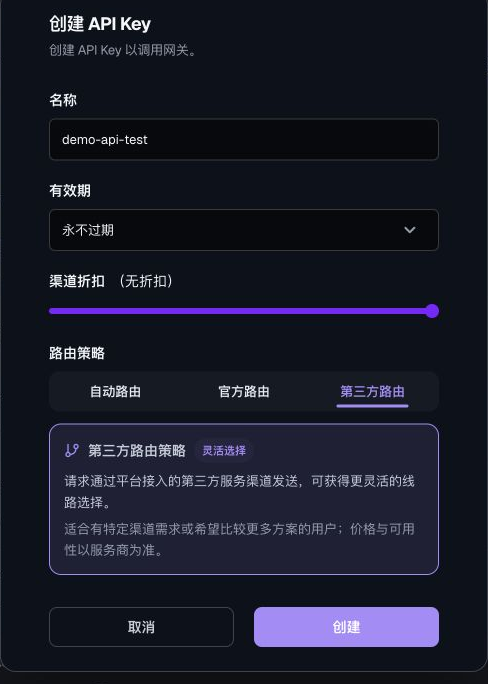

# Third-party routing tutorial

<!-- DOCS-NAV:START -->
[Documentation home](README.md) · [Public API reference ↗](https://documenter.getpostman.com/view/57297668/2sBYArUsxK) · [Agent Developer Center ↗](https://unexhub.ai/agent-doc) · [简体中文](../zh-CN/third-party-routing.md)

**Browse:** [Start here](README.md#start-here) · [API & account](README.md#api-and-account) · [Apps & editors](README.md#apps-and-editors) · [CLI & coding agents](README.md#cli-and-coding-agents) · [Agent development](README.md#agent-development) · [API reference](README.md#api-reference)
<!-- DOCS-NAV:END -->

<!-- DOCS-TOC:START -->

<strong>On this page</strong>

1. [1) Create a key with third-party routing](#section-1)
2. [2) Choose an available model](#section-2)
3. [3) Enter the connection details](#section-3)
4. [4) Send a request](#section-4)
5. [5) Review the request and charge](#section-5)

<!-- DOCS-TOC:END -->

Website: [UNEXHub](https://unexhub.ai/) · Interface reviewed: 2026-09-22

Third-party routing determines the upstream channel category UNEXHub uses. Cherry Studio and Chatbox are third-party clients. You can combine these clients with third-party routing, or use a key with another routing policy.

## 1) Create a key with third-party routing

Open [API Keys](https://unexhub.ai/console/token) → User View, if shown → Create Key.

Enter a purpose-specific name such as `cherry-thirdparty` or `chatbox-thirdparty`. Set expiration and channel discount, select Third-party Routing, and create the key.

The screenshot uses an example form name. Create a separate key for each client, confirm it is enabled, copy it, and set a budget limit.

## 2) Choose an available model

Open the [marketplace](https://unexhub.ai/market?tab=models) and check model status, protocol, and pricing. Copy the exact ID of a model supported by your route.

If provider or channel comparisons are shown, compare availability as well as pricing. A restrictive discount condition can reduce the available channels. Third-party routing is not guaranteed to be cheaper or available at all times.

## 3) Enter the connection details

| Setting | Value |
| --- | --- |
| API root | `https://api.unexhub.ai` |
| SDK Base URL | `https://api.unexhub.ai/v1` |
| Full chat endpoint | `https://api.unexhub.ai/v1/chat/completions` |
| API key | The UNEXHub key created in step 1. |
| Model ID | The available model ID copied in step 2. |

UNEXHub handles upstream routing. Continue using the UNEXHub address and key. You do not need to replace them with an upstream provider's address or key.

## 4) Send a request

Use the cURL example in [Quickstart](quickstart.md), or follow the [Cherry Studio](cherry-studio.md) or [Chatbox](chatbox.md) tutorial. Send a short prompt such as “Reply with one short greeting.”

Request flow: Code or client → UNEXHub authentication and routing → Available third-party channel → Model response.

## 5) Review the request and charge

Open [Request Logs](https://unexhub.ai/console/log) and filter by the dedicated key name, model, and time. Open the matching details and review Final Charge. Check the channel field as well if it is shown.

Client checks, model tests, automatic retries, title generation, and multiple-model replies may create extra requests. Conversation history may increase input usage. One visible message does not necessarily correspond to one API request.

Use UNEXHub's final charge for API billing. Any subscription charged by the client is separate. See [Billing records and exports](billing.md).

<!-- DOCS-PAGER:START -->

---

[← Previous: Chat Completions API](chat-completions.md) · [Documentation home](README.md) · [Next: Billing records →](billing.md)
<!-- DOCS-PAGER:END -->
