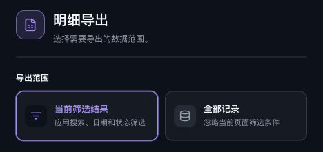

# 查看计费记录与导出账单

<!-- DOCS-NAV:START -->
[English (primary)](../en/billing.md) · [中文目录](README.md) · [公开 API 文档 ↗](https://documenter.getpostman.com/view/57297668/2sBYArUsxK) · [Agent 开发中心 ↗](https://unexhub.ai/agent-doc)

**目录：** [开始使用](README.md#start-here) · [API 与账户](README.md#api-and-account) · [客户端与编辑器](README.md#apps-and-editors) · [命令行与编程 Agent](README.md#cli-and-coding-agents) · [Agent 开发](README.md#agent-development) · [API 参考](README.md#api-reference)
<!-- DOCS-NAV:END -->

<!-- DOCS-TOC:START -->

<strong>本页目录</strong>

1. [1）在调用日志中找到请求](#section-1)
2. [2）查看计费详情和最终扣费](#section-2)
3. [3）查看资金账户的 API 消费](#section-3)
4. [4）导出 Excel 账单](#section-4)
5. [5）查看用量趋势](#section-5)
6. [6）处理扣费或记录异常](#section-6)

<!-- DOCS-TOC:END -->

适用站点：[UNEXHub](https://unexhub.ai/) · 界面核对：2026-09-22

代码调用、第三方路由、Cherry Studio 和 Chatbox 使用 UNEXHub Key 产生的 API 费用，都在 UNEXHub 查询。

## 1）在调用日志中找到请求

打开[调用日志](https://unexhub.ai/console/log)，选择「今天」「近 7 天」「近 30 天」或「自定义」。日期范围应包含请求时间。

成功调用可筛选「消费」，失败排查用「全部」或「错误」。点击「添加筛选」，按令牌名称、模型名称或 Request ID 定位，再点击「查询」。

| 字段 | 核对内容 |
| --- | --- |
| 时间 | 与调用时间和所在时区对应。 |
| 令牌、模型 | 与本次使用的 Key 和模型 ID 一致。 |
| 类型 | 区分消费、错误与其他记录。 |
| 输入、输出 | 查看用量；有缓存时同时核对缓存读写。 |
| 花费 | 查看费用摘要，再进入详情确认最终扣费。 |

字段因账户权限而异，缺少列时可查看「列设置」。API 响应中的 `id` 不一定等于控制台的 Request ID；没有请求标识时，可用时间、Key 和模型组合定位。

## 2）查看计费详情和最终扣费

点击匹配记录的「详情」，进入「请求详情分析 → 计费详情」。核对请求模型、状态、请求路径、处理时间和「最终扣费」。

页面可能列出官方原价、渠道折扣和计费过程。官方原价供参考，实际消费以「最终扣费」为准；模型价格、路由、缓存、阶梯计费和取整都可能影响金额。

### 区分用量与计费折算单位

| 口径 | 含义 |
| --- | --- |
| 输入与输出 tokens | 模型处理的用量，用于判断请求规模。 |
| 等价额度 token | 金额折算单位，不能作为模型输入或输出量。 |
| 最终扣费 | 本次实际扣除的金额，用于对账。 |

当前计费详情说明，等价额度 token 按 \$2 / 1M 折算，quota 结果四舍五入至整数。这是账户计费单位的换算，并不表示所有模型单价都是 \$2 / 1M。

模型价格中的 \$/M 表示每一百万 tokens 的美元价格。输入、输出、缓存创建和读取可能分别定价，不要用同一个单价乘总 tokens。

如果页面出现「供应商收入」或「平台抽成」，它们说明资金分配；核对自己的支出时，不要把这些分配金额再次加到最终扣费上。

## 3）查看资金账户的 API 消费

打开[资金账户](https://unexhub.ai/console/topup)，查看余额组成。在记录区域按日期筛选，并选择「API 消费」，核对金额、时间和状态。

资金记录可能显示“当日累计消耗”和调用次数，这是按日汇总。单次费用需回到调用日志查看。对比两处金额时，保持相同账户、日期范围和消费类型。

充值记录为「待支付」时，表示支付尚未完成；请确认到账后再使用对应余额。

## 4）导出 Excel 账单

先设置需要的日期和 API 消费筛选，再点击「明细导出」。

选择导出范围：

| 选项 | 含义 |
| --- | --- |
| 当前筛选结果 | 应用当前搜索、日期和状态条件。 |
| 全部记录 | 忽略当前页面的筛选条件。 |

核对“将导出”的记录数，再点击「导出 Excel」，获得 XLSX 文件。打开后检查日期范围、记录数和金额是否符合对账需要。

## 5）查看用量趋势

进入[用量分析](https://unexhub.ai/console/detail)，选择时间范围，查看调用量、Token 成本、平均延迟和错误率。若显示「全站／我的」切换，选择「我的」核对个人用量。

趋势页用于观察总体表现，单次扣费以日志详情为准。时间边界、统计口径和显示精度可能导致摘要与逐笔明细存在差异。

## 6）处理扣费或记录异常

找不到记录时，先核对调用环境和登录账户，扩大日期范围，清除多余筛选后刷新。超时或重试前，先检查原请求是否已经完成。

向 [support@unexhub.com](mailto:support@unexhub.com) 提供 Request ID（如有）、调用时间及时区、模型、Key 名称、错误信息和扣费金额。不要发送完整 Key。

<!-- DOCS-PAGER:START -->

---

[← 上一篇：第三方路由](third-party-routing.md) · [中文目录](README.md) · [下一篇：常见问题与排障 →](faq.md)
<!-- DOCS-PAGER:END -->
